# Stack

## 01. Stack 자료구조의 개념

### 1. Stack의 특성

* Stack: 프로그램에서 중요성가 활용도가 매우 높은 자료구조

  1. 물건을 쌓아 올리듯 자료를 쌓아 올린 형태의 자료구조임

  2. 스택에 저장된 자료는 선형구조를 가짐.

     선형구조: 자료 간의 관계가 1대 1의 관계를 가짐

     비선형구조: 자료 간의 관계가 1대 N의 관계를 가짐(예: 트리)

  3. 스택에 자료를 삽입하거나 스택에서 자료를 꺼낼 수 있음.

  4. 마지막에 삽입한 자료를 가장 먼저 꺼냄

  5. 후입선출(Last-In-First-Out)이라고 부름

### 2. Stack의 구현

* 자료구조

  자료를 선형으로 저장할 저장소가 필요함

  -C언어에서는 배열을 사용할 수 있음

  -파이썬에서는 리스트를 사용할 수 있음

  -저장소 자체를 스택이라 부르기도 함

  -스택에서 마지막 삽입된 원소의 위치를 top이라 부름

* 연산

  삽입: 저장소에 자료를 저장하고 보통 push라고 부름

  삭제: 저장소에서 자료를 꺼냄. 꺼낸 자료는 삽입한 자료의 역순으로 꺼냄 보통 pop이라고 부름

  isEmpty: 스택이 공백인지 아닌지를 확인하는 연산

  peek: 스택의 top에 있는 item(원소)을 반환하는 연산

### 3.Stack의 연산

스택의 삽입/삭제 연산과정

빈 스택에 원소 A,B,C를 차례로 삽입 후 한번 삭제하는 연산과정

top의 처음의 인덱스는 -1이 된다.

원소가 push될때마다 top의 값을 변경한다.

자료를 삭제해 pop연산 수행하면 마지막 원소를 반환하고 top은 1이 감소되어 저장된다.

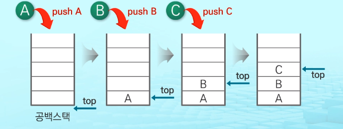

push 알고리즘

```python
def push(item):
    s.append(item)
```

파이썬의 리스트에선 크기에 상관없이 데이터삽입을 자유롭게 할수있다. 그래서 리스트로 구현시에는  오버플로우 문제를 고려할 필요가 없다. 그리고 데이터 삽입시 마지막을 기억하는 top 도 필요가 없다.

append method를 통해 데이터를 마지막에 삽입할 수 있다.

```python
def pop():
    if len(s) == 0:
        # underflow
        return
    else:
        return s.pop(-1)
```

인자값으로 -1 으로 하면 마지막 값이 반환되겠지.


* 구현하기

  1.스택을 구현하기

  2.구현한 스택을 이용하여 3개의 데이터를 스택에 저장하고 다시 3번 꺼내서 출력하기

```python
def push(item):
    s.append(item)
def pop():
    if len(s) == 0:
        print("Stack is Empty!!") # underflow
        return
    else:
        return s.pop(-1)
    
s = []
push(1)
push(2)
push(3)
print("pop item =>", pop())
print("pop item =>", pop())
print("pop item =>", pop())
```


* 스택 구현 고려사항

  리스트를 사용하여 스택을 구현하는경우

  장점: 구현이 용이하다는 장점

  단점: 리스트의 크기를 변경하는 작업은 내부적으로 큰 overhead 발생 작업으로 많은 시간이 소요

  => 해결방법

  -리스트의 크기가 변동되지 않도록 배열처럼 크기를 미리 정해놓고 사용하는 방법

  -동적 연결리스트를 이용하여 저장소를 동적으로 할당하여 스택을 구현하는 방법

  장점: 구현이 용이하다

  단점: 리스트로 구현하는 것 보다 구현이 복잡함.


## 02.Stack의 응용

### 1.괄호검사

* 괄호의 종류: 대괄호([ ]), 중괄호({ }), 소괄호( ( ) )

* 조건: 1. 왼쪽 괄호의 개수와 오른쪽 괄호의 개수가 같아야함.

  * 2. 같은 괄호에서 왼쪽 괄호는 오른쪽 괄호보다 먼저 나와야 함.3

    3. 괄호 사이에는 포함 관계만 존재함.

       **잘못된 괄호 사용의 예

       (a(b)   , a(b)c)   , a{b(c[d]e}f)

ex) 스택을 이용한 괄호 검사

다음은 수식을 표현한 문자열의 예. 문자열에서 한문자씩 stack에 넣고 만약 여는 괄호라면 stack에 저장하고 닫는괄호면 stack에서 pop하여 비교한다. 괄호수식이 끝났는데 스택에 괄호가 남아있으면 잘못된 괄호사용을 하고있는것으로 판명난다.

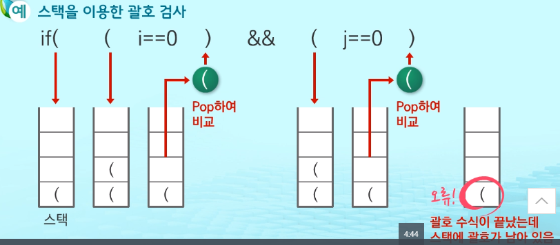


* 괄호를 조사하는 알고리즘 개요

  1. 문자열에 있는 괄호를 차례대로 조사

     2-1) 왼쪽 괄호를 만나면 스택에 삽입

     2-2) 오른쪽 괄호를 만나면 스택에서 top괄호를 삭제한 후 오른쪽 괄호와 짝이 맞는지 확인

     2-2-1)스택이 비어어있음. (조건1 또는 2 위배)

     2-2-2)괄호의 짝이 맞지 않음. (조건 3에 위배)

     2-2-3) 문자열 끝까지 조사한 후 스택에 괄호가 남아있음 (조건1에 위배)


### Function call

* 함수 호출 관리

  프로그램에서의 함수 호출과 복귀에 따른 수행 순서를 관리

  -가장 마지막에 호출된 함수가 가장 먼저 실행을 완료하고 복귀하는 후입선출 구조이므로, 후입선출 궂의 스택을 이용하여 수행순서 관리

  -함수 호출이 발생하면 호출한 함수 수행에 필요한 지역변수, 매개변수 및 수행 후 복귀할 주소 등의 정보를 스택 프레임에 저장하여 시스템 스택에 삽입

  -함수의 실행이 끝나면 시스템 스택의 top원소(스택프레임)를 삭제(pop)하면서 프레임에 저장되어 있던 복귀주소를 확인하고 복귀

  -함수 호출과 복귀에 따라 이 과정을 반복하여 전체 프로그램 수행이 종료되면 시스템 스택은 공백 스택이 됨

* 함수 호출 수행 순서

  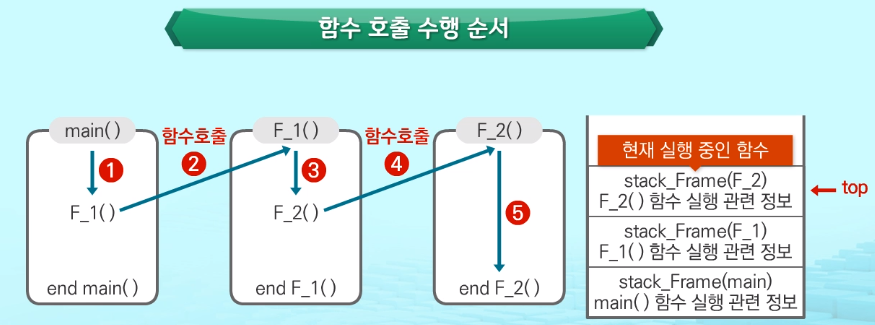

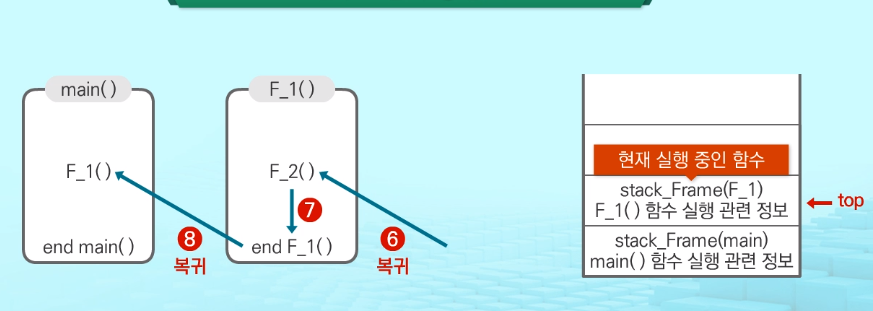

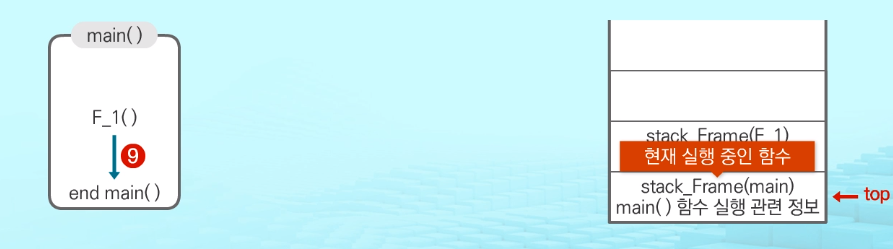

마지막으로 stack_Frame(main)까지 없어지고 공백이된다.

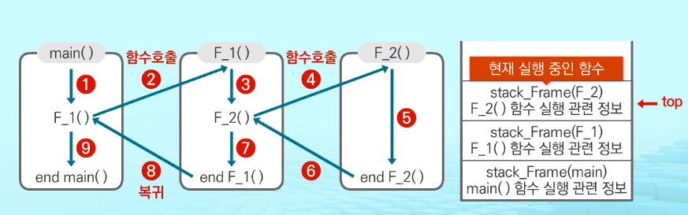


* 재귀호출

  1.자기 자신을 호출하여 순환 수행되는 것

  2.함수에서 실행해야 하는 작업의 특성에 따라 일반적인 호출방식보다 재귀호출 방식을 사용하여 함수를 만들면 프로그램의 크기를 줄이고 간단하게 작성할 수 있음

  3.디버깅이 어렵고 잘못 작성하게 되면 수행 시간이 많이 소요됨

ex) 재귀 호출을 작성할 수 있는 함수 - factorial

​	n에 대한 factorial: 1부터 n까지의 모든 자연수를 곱하여 구하는 연산

​	Factorial 함수에서 n=4인 경우의 실행


앞서 살펴본 함수의 호출과의 차이점은

스택프레임으로 스택에 저장되는 값이 입력값이 틀린 같은 함수의 스택프레임을 저장한다는 차이점이 있음!

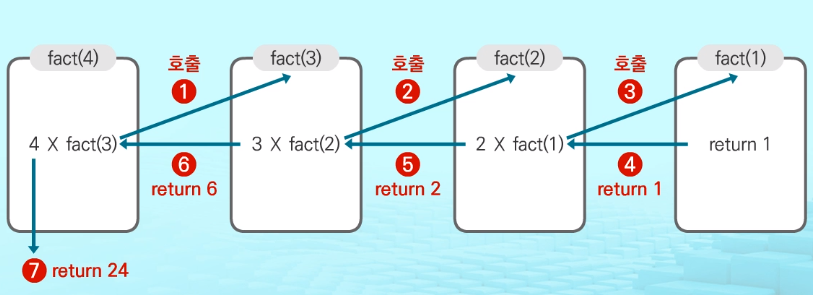


## 03.Memorization

### 1. 피보나치 수열

ex) 재귀호출을 작성할 수 있는 함수 - 피보나치 수열을 구하는 함수

 1. 0과 1로 싲가하고 이전의 두수 합을 다음 항으로 하는 수열

 2. 피보나치 수열의 i 번째 값을 계산하는 함수 F를 정의하면 다음과 같음

    F0 = 0, F1 = 1

    Fi = Fi-1 + Fi-2 for i>=2

	3. 위의 정의로부터 피보나치 수열의 i번째 항을 반환하는 함수를 재귀함수로 구현할 수 있음.


피보나치 수열을 구하는 함수의 알고리즘

```python
def fibo(n):
    if n < 2:
        return n
    else:
        return fibo(n-1) + fibo(n-2)
```

문제점: 엄청난 중복 호출이 존재함!

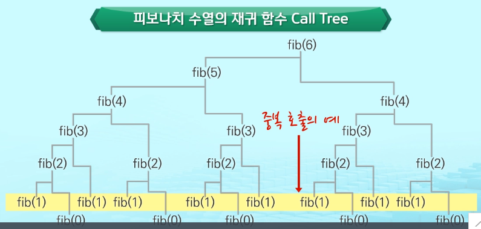

메모이제이션의 의미

-컴퓨터 프로그램을 실행할 때 이전에 계산한 값을 메모리에 저장해서 매번 다시 계산하지 않도록 하여 전체적인 실행속도를 빠르게 하는 기술

-DP(동적계획법)의 핵심이 되는 기술


Memoization 단어의 의미

-글자 그대로 해석하면 '메모리에 넣기'(to put in memory)'라는 의미

-'기억되어야 할 것'이라는 뜻의 라틴어 Memorandum에서 파생

-흔히 '기억하기', '암기하기'라는 뜻의 Memorization과 혼동하지만, 정확한 단어는 Memoization으로 동사형은 memoize임


Memoization방법을 적용한 알고리즘

-피보나치 수를 구하는 알고리즘에서 fibo(n)의 값을 계산하자마자 저장하면 실행시간을 줄일 수 있음.

-만약 기존에 계산하여 저장된 값이 있을 경우에는 다시 계산하지 않겠다는 알고리즘.

```python
# memo를 위한 리스트를 생성하고,
# memo[0]를 0으로 memo[1]는 1로 초기화 한다.
def fibo1(n):
    global memo
    if n>= 2 and len(memo) <= n:
        memo.append(fibo1(n-1) + fibo1(n-2))
    return memo[n]

memo = [0, 1]
```

## 04.DP(동적 계획법)

### 1. DP(동적 계획법) 알고리즘

-Dynamic Programming의 약자

-그리디 알고리즘과 같이 최적화 문제를 해결하는 알고리즘

-먼저 입력 크기가 작은 부분 문제들을 모두 해결한 후에 그 해들을 이용하여 보다 큰 크기의 부분 문제들을 해결

-최종적으로 원래 주어진 입력의 문제를 해결


* 피보나치 수를 구하는 함수에 DP 적용하기

  (부분 문제의 답으로부터 본 문제의 답을 얻을 수 있는 최적 부분 구조로 이루어져 있어 DP를 적용할 수 있음.)

  1. 문제를 부분 문제로 분할
  
     Fibonacci(n) 함수는 Fibonacci(n-1)과 Fibonacci(n-2)의 합

      Fibonacci(n-1)은  Fibonacci(n-2)와  Fibonacci(n-3)의 합
  
      Fibonacci(2)는  Fibonacci(1)과  Fibonacci(0)의 합
  
      Fibonacci(n)은  Fibonacci(n-1),  Fibonacci(n-2),  .. Fibonacci(2),
  
      Fibonacci(1),  Fibonacci(0) 의 부분집합으로 나뉨.
  
  2. 부분 문제로 나누는 일을 끝냈으면 가장 작은 부분 문제부터 해를 구함.
  
  3. 그 결과는 테이블에 저장하고, 테이블에 저장된 부분 문제의 해를 이용하여 상위 문제의 해를 구함
  
  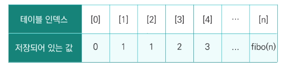

* 피보나치 수를 DP에 적용한 알고리즘

  ```python
  def fibo2(n):
      f = [0, 1]
      
      for i in range(2, n+1):
          f.append(f[i-1] + f[i-2])
      
      return f[n]
  ```

  

* DP의 구현방식

recursive방식: fibo()

-재귀적 구조는 내부에 시스템 호출 스택을 사용하는 overhead가 발생할 수 있음.

iterative방식: fibo2()

-Memoization을 재귀적  구조에 사용하는 것보다 반복적 구조로 DP를 구현한 것이 성능면에서 보다 효율적.


## 05.DFS(깊이 우선 탐색)

### 1.DFS(깊이 우선 탐색)이란?

비선형구조인 그래프 구조는 그래프로 표현된 모든 자료를 빠짐없이 검색하는것이 중요.

1. 깊이우선탐색(Depth First Search, DFS)
2. 너비 우선 탐색 (Breadth First Search, BFS)


DFS(깊이 우선 탐색)방법

1.시작 정점의 한 방향으로 갈 수 있는 경로가 있는 곳까지 깊이 탐색

2.더 이상 갈 곳이 없게 되면, 가장 마지막에 만났던 갈림길 간선이 있는 정점으로 되돌아옴

3.다른 방향의 정점으로 탐색을 계속 반복하여 결국 모든 정점을 방문하여 순회

4.가장 마지막에 만났던 갈림길의 정점으로 되돌아가서 다시 깊이 우선 탐색을 반복해야 하므로 후입선출 구조의 스택을 사용.


### 2. DFS(깊이 우선 탐색) 알고리즘

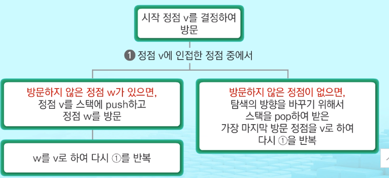

스택이 공백이 될때까지 위의 과정을 반복한다.


* 구체화한 알고리즘

  ```C
  visitedp[], stack[] 초기화
  DFS(v)
      v 방문;
  	visited(v) <- true:
  	do{
          if(v의 인접 정점 중 방문 안한 w찾기)
              push(v);
          while(w){
              w 방문;
              visited[w] <- true;
              push(w):
              v <- w
             	v의 인접 정점 중 방문 안 한 w 찾기
          }
          v <-pop(stack)
      } while(v)
   end DFS()
  ```

  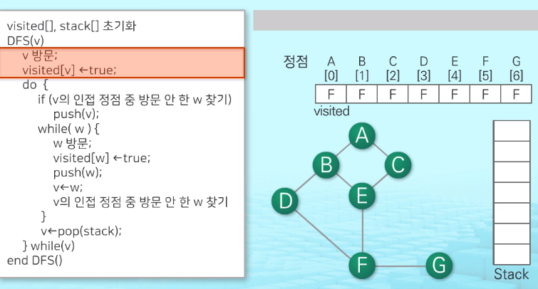

과정 을 보고 싶다면 2분~8분까지보기.


깊이 우선 탐색의 순서를 따라가 보면 A,B,D,F,C,G 순으로 탐색함.

-> 한쪽 방향으로 계속 탐색하다가 더 이상 진행 할 수 없으면 다시 되돌아 오는 방법으로 탐색했다는 것을 확인할 수 있음.

->다시 되돌아 오기 위해 사용한 자료구조로 스택을 사용했음.


방향성이 있을경우 한번만 탐색하지만, 방향성이 없을경우 양방향으로 체크해줘야한다. dfs_recursive.py 파일처럼.